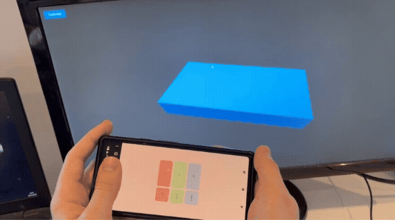

# mobile-motion-controller
Mobile device motion controller, minimal example.



## Setup

Install JS dependencies
```sh
npm install
```

Create self-signed SSL certificate
```sh
openssl req -x509 -newkey rsa:4096 -keyout sslcert/key.pem -out sslcert/cert.pem -sha256 -days 365 -nodes
```

Make sure port 8443 on your PC is open to your local network.

## Running the project

1. Start the server with: `node server.js`

2. Navigate to `https://{server-local-ip}:8443/app` in a browser on your PC. You should see a blue box.

3. Navigate to `https://{server-local-ip}:8443` on your smartphone. Allow device orientation if prompted. You should see rotation values change as you move the smartphone.

4. Point the phone at your PC's display and click the calibrate button.

5. The orientation of the blue box should now copy that of your smartphone.
